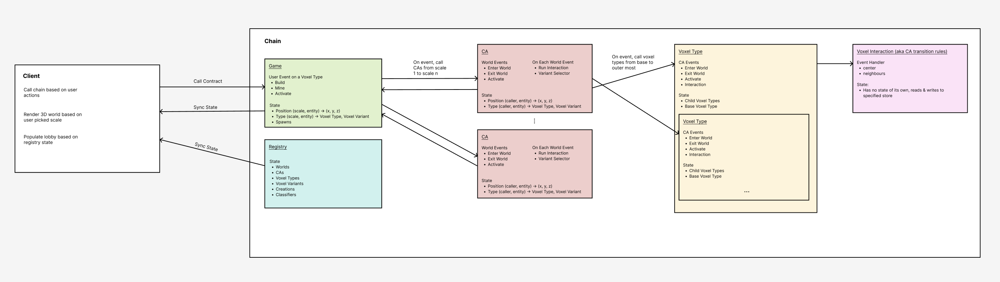

# Everlon

### Architecture



### Installation

1. Run `brew install yarn` to install yarn
2. Run `yarn set version stable` to generate `.yarnrc.yml` and use the latest stable version of yarn (3.6.0)
   - We need to use at least yarn 3.6.0 because we need to link the yarn packages, which have pnpm-based package.jsons.
     If we use an earlier version of yarn, we would not be able to link the dependencies of each mud package, because they use workspace:\* syntax
     when specifying dependencies: (e.g. `"@latticexyz/common": "workspace:\*"`)
   - yarn 3.6.0 can interpret these dependencies, earlier versions of yarn cannot
3. Add `nodeLinker: node-modules` to `.yarnrc.yml` to tell yarn that we want our dependencies to be stored in node_modules files
4. Run `yarn install` at the top directory to install dependencies
   - Note: Since we are using a local fork of MUD, yarn will symlink each of mud's packages inside the node_modules file at the top directory.
5. Clone our mud fork at https://github.com/tenetxyz/mud and place it in the same directory as this directory:

```
development/
   everlon/
   mud/
```

- Note: We've forked MUD so we can modify some of the packages. This repo depends on our fork of MUD.

6. In our mud fork, run pnpm install (to install all dependencies)
7. In our mud fork, run pnpm build (to build all packages)

- Everytime you change a file in the package, just remember to `pnpm build`.
- If you don't want to build all packages in mud, you can build each individual package by:
  1. `cd`ing into the package (eg `cd packages/recs`)
  2. run `pnpm build`

### Running locally

Run `./t run dev` in the top directory
